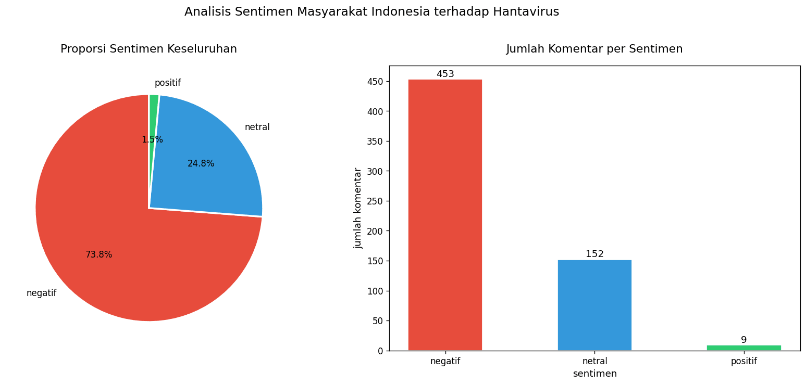
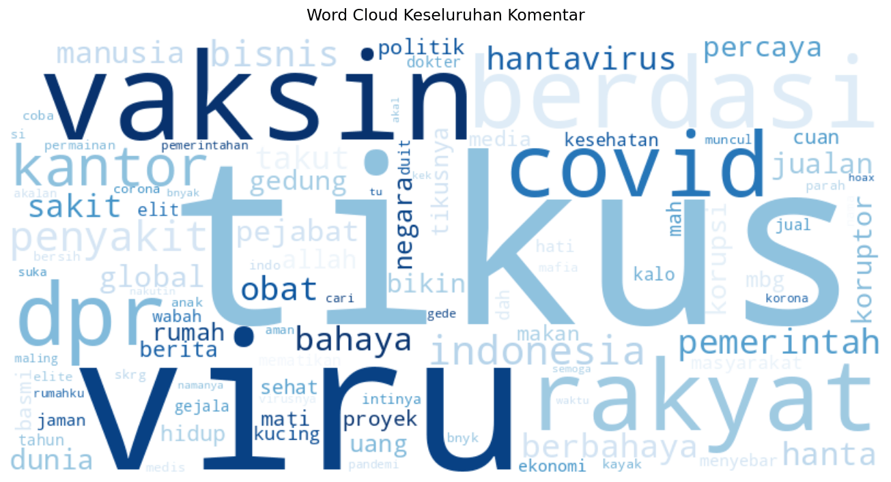
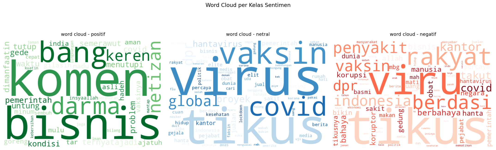
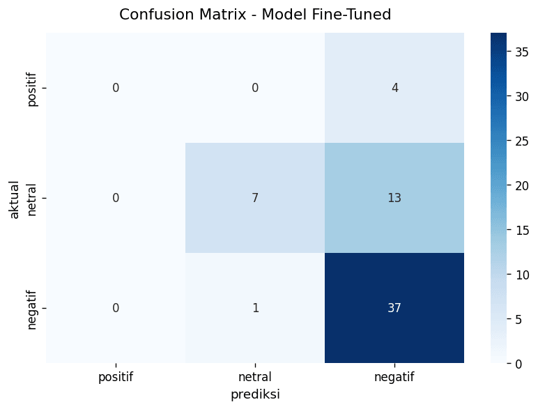

# IndoBERT for Hantavirus Sentiment Analysis

**How did Indonesians react to hantavirus news on YouTube? Sentiment analysis of 779 comments with IndoBERT.**
**Bagaimana reaksi warganet Indonesia terhadap berita hantavirus di YouTube? Analisis sentimen 779 komentar dengan IndoBERT.**

[English](#english) · [Bahasa Indonesia](#bahasa-indonesia)

---

## English

When hantavirus started making the news in Indonesia, the comment section of [this YouTube video](https://www.youtube.com/watch?v=ADx6GXcXhbs) filled up fast. I collected those comments and ran them through IndoBERT, a BERT model pre-trained on Indonesian text, to see how people actually felt about it.

### What I found

- **Most comments were negative: 73.8%** (453 of 614), with 24.8% neutral and only 1.5% positive.
- **A lot of the negativity wasn't about the virus at all.** Hantavirus spreads through rats, and "tikus" (rat) is also everyday Indonesian slang for corrupt officials. Many of the most-liked comments were jokes about "tikus berdasi" (rats in suits) and the DPR, the national parliament. The single most-liked comment in the dataset is one of them.
- **The rest was real worry**, often colored by memories of COVID-19, plus a fair share of distrust ("just another vaccine business").
- **Positive comments were rare and mostly jokes.** Even the top "positive" one was humor, and the model was only 47% sure about it.

### How it was done

1. **Collecting.** Pulled 779 comments and replies with the YouTube Data API v3.
2. **Cleaning.** Removed links, mentions, hashtags, emoji and symbols, normalized common slang ("yg" to "yang", "gak" to "tidak", and about 80 more), removed stopwords with Sastrawi, then dropped duplicates and comments shorter than three words. That left **614 comments**.
3. **Labeling with a ready-made model.** Classified every comment with [`ayameRushia/bert-base-indonesian-1.5G-sentiment-analysis-smsa`](https://huggingface.co/ayameRushia/bert-base-indonesian-1.5G-sentiment-analysis-smsa), an IndoBERT model already fine-tuned for Indonesian sentiment.
4. **Fine-tuning my own.** Used those labels to fine-tune [`indobenchmark/indobert-base-p1`](https://huggingface.co/indobenchmark/indobert-base-p1) on this specific topic (80/10/10 split, 3 epochs, learning rate 2e-5). It reached **71% accuracy** on the test set, with an F1 of 0.80 on the negative class. After fine-tuning, 88 comments (14.3%) changed label, mostly from neutral to negative on comments like "virus koruptor".
5. **Exploring the results.** Word clouds per sentiment, confidence distributions, and the most-liked comments in each class.

### Limitations

- The training labels come from the first model, not from people labeling by hand, so the fine-tuned model mostly learns to agree with it.
- Positive comments are very rare, so the model never really learned that class: all 4 positive comments in the test set were predicted as negative.
- Everything comes from one video, so this shows how one audience reacted, not all of Indonesia.

### Run it yourself

1. Open the notebook with the **Open in Colab** button above. A GPU runtime makes the fine-tuning much faster.
2. Get a YouTube Data API v3 key from the [Google Cloud Console](https://console.cloud.google.com/apis/library/youtube.googleapis.com).
3. In Colab, open **Secrets** (the key icon in the left sidebar), add it as `YOUTUBE_API_KEY`, and allow the notebook to access it.
4. Run all cells. To analyze a different video, change `VIDEO_ID`.

**Built with:** Python · Hugging Face Transformers · PyTorch · IndoBERT · YouTube Data API · Sastrawi · scikit-learn · Pandas · Matplotlib · Seaborn · WordCloud

---

## Bahasa Indonesia

Ketika hantavirus mulai ramai diberitakan di Indonesia, kolom komentar [video YouTube ini](https://www.youtube.com/watch?v=ADx6GXcXhbs) langsung dipenuhi komentar. Saya mengumpulkan komentar-komentar tersebut dan menganalisisnya dengan IndoBERT, model BERT yang dilatih dengan teks berbahasa Indonesia, untuk melihat bagaimana sebenarnya perasaan warganet.

### Temuan

- **Mayoritas komentar bernada negatif: 73,8%** (453 dari 614), lalu 24,8% netral dan hanya 1,5% positif.
- **Banyak komentar negatif yang justru bukan soal virusnya.** Hantavirus menular lewat tikus, dan "tikus" juga sindiran sehari-hari untuk koruptor. Banyak komentar dengan likes terbanyak berisi candaan soal "tikus berdasi" dan DPR, termasuk komentar paling populer di seluruh dataset.
- **Sisanya kekhawatiran yang tulus**, sering kali dibayangi trauma COVID-19, ditambah cukup banyak rasa tidak percaya ("bisnis vaksin lagi").
- **Komentar positif sangat sedikit dan kebanyakan candaan.** Bahkan komentar "positif" paling populer sebenarnya humor, dan model hanya 47% yakin dengan labelnya.

### Cara pengerjaan

1. **Pengumpulan data.** Mengambil 779 komentar beserta balasannya dengan YouTube Data API v3.
2. **Pembersihan.** Menghapus link, mention, hashtag, emoji, dan simbol, menormalisasi kata gaul ("yg" jadi "yang", "gak" jadi "tidak", dan sekitar 80 kata lainnya), menghapus stopword dengan Sastrawi, lalu membuang duplikat dan komentar yang kurang dari tiga kata. Hasilnya **614 komentar**.
3. **Pelabelan dengan model jadi.** Mengklasifikasikan setiap komentar dengan `ayameRushia/bert-base-indonesian-1.5G-sentiment-analysis-smsa`, model IndoBERT yang sudah di-fine-tune untuk sentimen Bahasa Indonesia.
4. **Fine-tuning model sendiri.** Memakai label tersebut untuk fine-tune `indobenchmark/indobert-base-p1` pada topik ini (pembagian 80/10/10, 3 epoch, learning rate 2e-5). Hasilnya **akurasi 71%** pada test set, dengan F1 0,80 untuk kelas negatif. Setelah fine-tuning, 88 komentar (14,3%) berubah label, kebanyakan dari netral ke negatif pada komentar seperti "virus koruptor".
5. **Eksplorasi hasil.** Word cloud per sentimen, distribusi confidence, dan komentar terpopuler di tiap kelas.

### Keterbatasan

- Label untuk training berasal dari model pertama, bukan dari pelabelan manual, jadi model hasil fine-tuning pada dasarnya belajar meniru model tersebut.
- Komentar positif sangat sedikit, sehingga model belum benar-benar mempelajari kelas ini: keempat komentar positif di test set diprediksi negatif.
- Semua data berasal dari satu video, jadi hasilnya menggambarkan reaksi satu kelompok penonton, bukan seluruh masyarakat Indonesia.

### Menjalankan sendiri

1. Buka notebook lewat tombol **Open in Colab** di atas. Runtime GPU akan membuat proses fine-tuning jauh lebih cepat.
2. Buat API key YouTube Data API v3 di [Google Cloud Console](https://console.cloud.google.com/apis/library/youtube.googleapis.com).
3. Di Colab, buka **Secrets** (ikon kunci di sidebar kiri), tambahkan key tersebut dengan nama `YOUTUBE_API_KEY`, lalu izinkan notebook mengaksesnya.
4. Jalankan semua cell. Untuk menganalisis video lain, ganti `VIDEO_ID`.

---

Made by [Nabiel Yandra](https://github.com/nabielyr).
